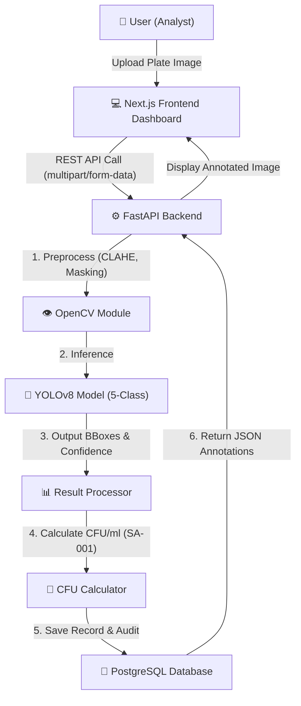
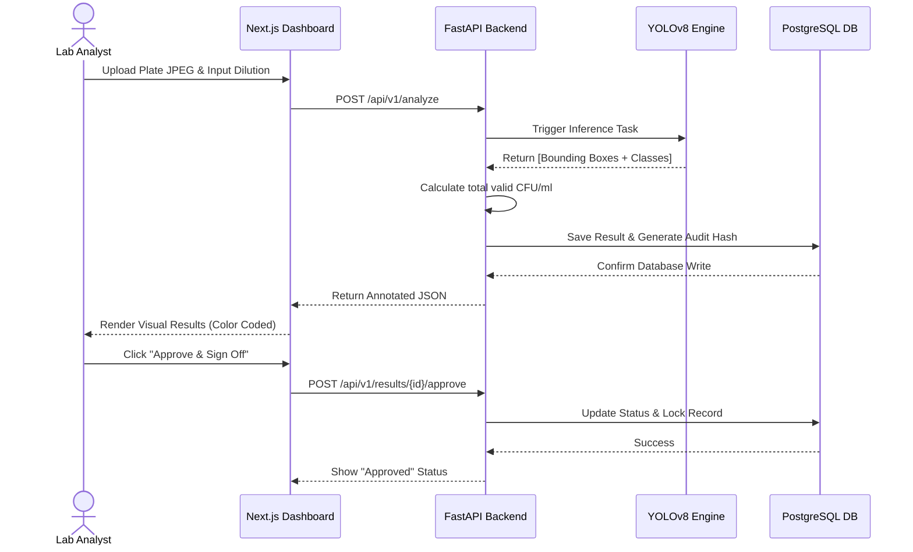
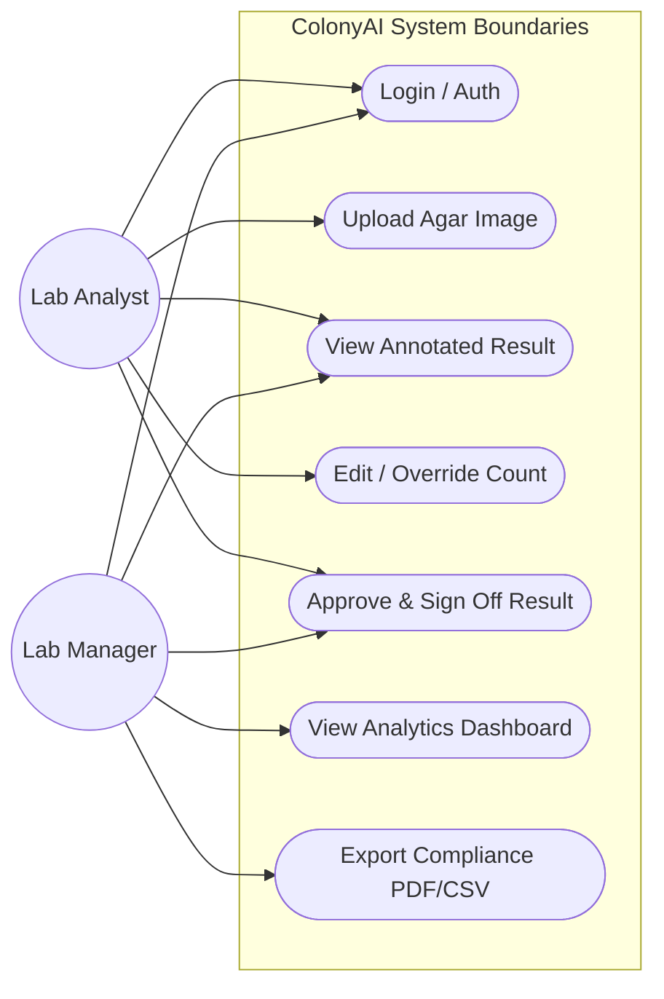
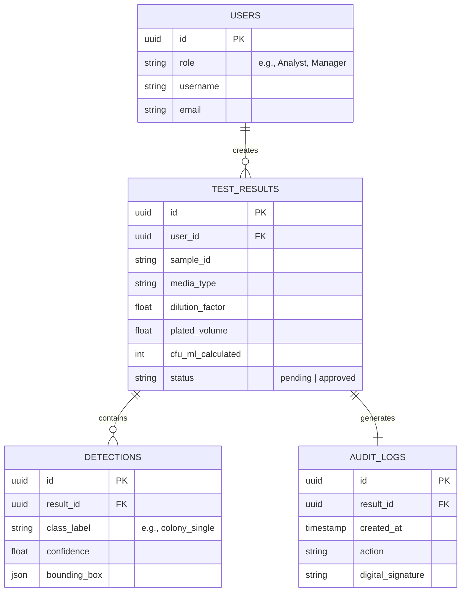

# 🧫 ColonyAI

**Intelligent Automated Plate Count Reader for Microbiology Laboratories**

_Modernizing microbiology through high-precision AI computer vision._

---

## 📑 Executive Summary
ColonyAI is an enterprise-grade intelligent laboratory platform that transforms agar plate images into accurate, standardized CFU/ml reports in **under two minutes**. Built specifically for the **AI Open Innovation Challenge 2026**, the system addresses critical inefficiencies in manual Total Plate Count (TPC) workflows across Indonesian microbiology laboratories. 

By eliminating the 22.7%–80% inter-analyst variability commonly found in manual counting, ColonyAI accelerates throughput, reduces operational costs by up to 40%, and ensures compliance with strict food safety regulations.

---

## 🎯 The Problem & Our Solution

### 🚨 The Bottleneck
In Indonesian laboratories, current **Total Plate Count (TPC)** workflows suffer from critical failures:
1. **High Error Margins:** Inter-analyst variability causes massive discrepancies when two humans count the same plate (ASTM F2944).
2. **Throughput Limitations:** Manual counting restricts an analyst to only 20–40 plates per hour, causing huge inspection backlogs.
3. **Artifact Confusion:** Human analysts constantly struggle to differentiate between valid colonies and debris (bubbles, dust, agar cracks).

### 💡 Our Innovation
We deliver a complete Web-SaaS ecosystem powered by a fine-tuned **YOLOv8 object detection model**. Our core difference lies in our **5-Class Media-Agnostic Intelligence**:
- The model simultaneously classifies `colony_single`, `colony_merged`, `bubble`, `dust_debris`, and `media_crack`.
- Automatically filters out non-colony objects (bubbles & dust), ensuring accuracy that generic AI models cannot achieve.
- Calculates regulatory-compliant CFU/ml taking into account Plated Volume and Dilution Factor (SA-001 calculation logic).

---

## 🧩 System Architecture & UML Documentation

To satisfy the highest standards of software engineering, ColonyAI is architected using distinct modular layers. Below are the extensive UML and Workflow diagrams detailing the system logic.

### 1. High-Level Workflow Architecture
This diagram outlines how data moves from the user's browser, into the API layer, processed by the OpenCV/YOLO pipeline, and stored immutably.

### 2. Sequence Diagram: Inference Lifecycle
This sequence tracks the timeline of events from the moment an analyst submits an image until they legally sign off on the results for BPOM/ISO compliance.

### 3. Use Case Diagram
Defining the boundary of actor interactions within the ColonyAI ecosystem.

### 4. Entity Relationship (ER) Diagram
Our database is strictly ACID-compliant. The structure guarantees that every test result is immutable and perfectly aligned with ISO 17025 audit trail standards.

---

## 💻 Tech Stack Highlights
ColonyAI is engineered as a modern, infinitely scalable platform utilizing state-of-the-art libraries:

| Layer | Technologies | Role / Use Case |
|:---:|:---|:---|
| **Frontend** | `Next.js 14`, `React`, `Tailwind CSS` | High-performance Server-Side Rendered dashboard |
| **Backend & API** | `FastAPI (Python 3.10+)` | Fast async API, strict Pydantic data validation |
| **CV & AI Engine** | `YOLOv8`, `OpenCV` | Inference engine and image pre-normalization |
| **Database** | `PostgreSQL`, `Supabase` | Persistent storage, JWT Auth, Role Based Access |
| **Infrastructure** | `Vercel`, `Railway`, `AWS S3` | Web hosting, container orchestration, encrypted storage |

---

## 📅 Agile Project Management
We utilize an extremely rigorous Agile workflow. Our development cycle is structured as a **1-Month Intensive Sprint (April 2026)** to meet the competition deadline.

- **Sprint Planning & Backlog:** [View Detailed Plan](project-management/03-sprint-plan.md)
- **Daily Standups:** Continuous daily progress logging in GitHub format.
- **Workflow:** Code merges follow strict branch routing (`feature` -> `develop` -> `main`).

---

## 👥 Meet The Team

| Member | Role | Focus |
|--------|------|-------|
| **Wisnu Alfian Nur Ashar** | Product Owner | **Frontend Lead** & Product Vision |
| **Muhammad Faras** | Scrum Master | **AI/CV Integration** & Agile Lead |
| **Suci** | Developer | **UI/UX Designer** & Frontend Implementation |
| **Steven** | Developer | **Backend Engineer** & QA/Data Analysis |

**Institution:** President University — Bachelor of Information Technology  

---

## 🔒 Confidentiality Notice
> **Proprietary Software — AI Open Innovation Challenge 2026**  
> *The source code, installation scripts, model weights, and environmental configurations for this repository are strictly confidential. Deployment instructions and training scripts have been intentionally omitted from this public README to protect the intellectual property of the team during the competition and presentation phases.*

 
<strong>ColonyAI</strong> — Accurate. Consistent. Reproducible.
 
🧫🤖 2026

