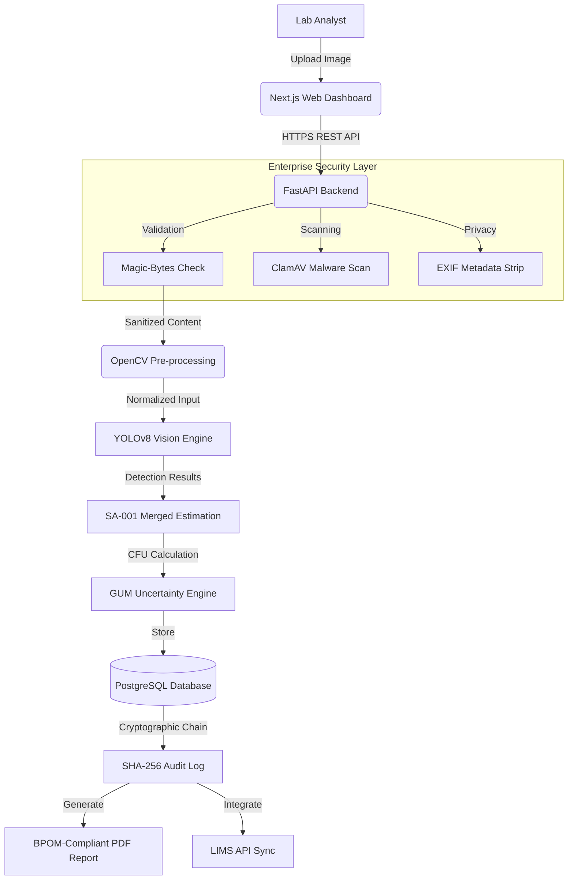

# ColonyAI System Architecture

> Comprehensive architecture, data flow, and component design documentation.

---

## Overview

ColonyAI follows a modern three-tier architecture with clear separation of concerns: **Presentation**, **Application**, and **Data** tiers. The system is built for scalability, security, and regulatory compliance (ISO 17025).

### AI/ML Stack: From CNN Theory to Production

ColonyAI's vision engine is built on **Convolutional Neural Network (CNN)** architecture — the same foundational technology covered in the AI Open 2026 workshop. Understanding these CNN components is key to grasping how colony detection works:

| Component | Workshop Concept | ColonyAI Implementation |
|-----------|-----------------|------------------------|
| **Kernel (Filter)** | 3×3 matrix sliding over image | YOLOv8 backbone uses 3×3 and 1×1 kernels in CSPDarknet |
| **Stride 1** | Filter moves 1 pixel at a time → preserves spatial resolution | Used in backbone feature extraction layers |
| **Stride 2** | Filter moves 2 pixels → downsamples feature map | Used in transition layers (replaces MaxPool in modern CNN) |
| **Padding Same** | Output size = input size (pad edges with zeros) | Applied in all convolutional layers to preserve spatial dims |
| **Padding Resolusi Burem (Valid)** | No padding → output shrinks | Used at some transition points for downsampling |
| **Pooling (MaxPool2d)** | 2×2 window, take max → reduce dims by 2× | YOLOv8 uses Stride-2 conv instead, but conceptually equivalent |
| **Flatten → FC Layer** | 2D feature maps → 1D vector → classification | YOLOv8 uses 1×1 conv + global average pooling instead |

The workshop's `SimpleCNN` (Conv2d → ReLU → MaxPool → Conv2d → ReLU → MaxPool → FC) mirrors ColonyAI's detection pipeline conceptually, but YOLOv8 replaces the basic sequential design with a modern CSPDarknet backbone + PANet neck + Decoupled head for multi-scale object detection.

**Why YOLOv8 over a simple CNN?**
- Simple CNN classifies the *entire image* into one category (e.g., "has colonies" vs "empty")
- YOLOv8 detects *individual objects* with bounding boxes — critical for CFU counting
- Workshop CNN stride=2 halves feature maps; YOLOv8 uses stride=2 conv + FPN to detect at multiple scales

### Data Freshness: Continuous Learning Pipeline

A key concern from the workshop was ensuring AI models don't "expire" as new data arrives. ColonyAI addresses this with:

1. **Model Swap API** — Upload new `.pt` / `.onnx` / `.engine` models without restarting the server
2. **Auto-Threshold Calibration** — Run `ml-training/calibrate.py` to find optimal per-class confidence thresholds for new datasets
3. **Singleton Architecture** — Model loaded once globally; activation of a new model instantly resets the singleton via `reset_detector()`
4. **Multi-Format Training Pipeline** — `ml-training/train.py` auto-detects YOLO, COCO JSON, and Pascal VOC formats


---

## Architecture Diagram



### Data Flow Description

1. **Security-First Ingestion**: Every file undergoes multi-layer validation (MIME check, malware scan, metadata removal) before entering the processing pipeline.
2. **AI Inference**: The YOLOv8 model provides real-time detection across 5 object classes, with merged colony estimation for improved accuracy.
3. **Regulatory Integrity**: Results are calculated with metrological uncertainty (GUM) and finalized with a cryptographically secure audit trail.

---

## Three-Tier Architecture

```
┌──────────────────────────────────────────────────────────────────────────────┐
│                           PRESENTATION TIER                                  │
│                            (Next.js 14)                                       │
│                                                                               │
│   ┌──────────────────────────────────────────────────────────────┐          │
│   │                      Client Browser                           │          │
│   │                                                               │          │
│   │   ┌──────────┐  ┌──────────┐  ┌──────────┐  ┌──────────┐   │          │
│   │   │  Login   │  │Dashboard │  │  Upload  │  │ Reports  │   │          │
│   │   │  Page    │  │  Home    │  │  Page    │  │  Export   │   │          │
│   │   └──────────┘  └──────────┘  └──────────┘  └──────────┘   │          │
│   │                                                               │          │
│   │   ┌──────────────────────────────────────────────────┐       │          │
│   │   │              UI Components (shadcn/ui)           │       │          │
│   │   │   Buttons, Forms, Tables, Modals, Charts, etc.  │       │          │
│   │   └──────────────────────────────────────────────────┘       │          │
│   └──────────────────────────────────────────────────────────────┘          │
└─────────────────────────────┬────────────────────────────────────────────────┘
                              │
                              │ HTTPS (REST API + WebSocket)
                              │
┌─────────────────────────────▼────────────────────────────────────────────────┐
│                           APPLICATION TIER                                    │
│                            (FastAPI Backend)                                    │
│                                                                               │
│   ┌──────────────────────────────────────────────────────────────┐          │
│   │                      API Gateway Layer                        │          │
│   │   ┌──────────┐  ┌──────────┐  ┌──────────┐  ┌──────────┐  │          │
│   │   │   Auth   │  │  Images  │  │ Analyses │  │  Reports │  │          │
│   │   │  Routes  │  │  Routes  │  │  Routes  │  │  Routes  │  │          │
│   │   └──────────┘  └──────────┘  └──────────┘  └──────────┘  │          │
│   └──────────────────────────────────────────────────────────────┘          │
│                                                                               │
│   ┌──────────────────────────────────────────────────────────────┐          │
│   │                   Business Logic Layer                        │          │
│   │                                                               │          │
│   │   ┌────────────────┐    ┌────────────────┐                   │          │
│   │   │    Image       │    │   Colony       │                   │          │
│   │   │  Preprocessor  │───▶│   Detector     │                   │          │
│   │   │   (OpenCV)     │    │  (YOLOv8)      │                   │          │
│   │   └────────────────┘    └───────┬────────┘                   │          │
│   │                                 │                            │          │
│   │                                 ▼                            │          │
│   │                          ┌────────────────┐                 │          │
│   │                          │    CFU/ml      │                 │          │
│   │                          │  Calculator    │                 │          │
│   │                          │  (GUM + SA001) │                 │          │
│   │                          └────────────────┘                 │          │
│   └──────────────────────────────────────────────────────────────┘          │
│                                                                               │
│   ┌──────────────────────────────────────────────────────────────┐          │
│   │                   Middleware & Security                        │          │
│   │   ┌──────────┐  ┌──────────┐  ┌──────────┐  ┌──────────┐  │          │
│   │   │   CORS   │  │   JWT    │  │   Rate   │  │  Audit   │  │          │
│   │   │ Handler  │  │  Auth    │  │ Limiter  │  │  Logger  │  │          │
│   │   └──────────┘  └──────────┘  └──────────┘  └──────────┘  │          │
│   └──────────────────────────────────────────────────────────────┘          │
└─────────────────────────────┬────────────────────────────────────────────────┘
                              │
                              │ Database Connections (ORM)
                              │
┌─────────────────────────────▼────────────────────────────────────────────────┐
│                              DATA TIER                                        │
│                                                                               │
│   ┌────────────────────────────┐          ┌────────────────────────┐         │
│   │      PostgreSQL DB         │          │     AWS S3 Storage     │         │
│   │      (via Supabase)        │          │                        │         │
│   │                            │          │   ┌────────────────┐  │         │
│   │   ┌──────────────────┐    │          │   │   Original    │  │         │
│   │   │ - users          │    │          │   │   Images      │  │         │
│   │   │ - analyses       │    │          │   └────────────────┘  │         │
│   │   │ - audit_logs     │    │          │   ┌────────────────┐  │         │
│   │   │ - token_blacklist│    │          │   │  Annotated     │  │         │
│   │   │ - reports        │    │          │   │   Images       │  │         │
│   │   └──────────────────┘    │          │   └────────────────┘  │         │
│   │                            │          │   ┌────────────────┐  │         │
│   │   AES-256 encrypted        │          │   │   Reports     │  │         │
│   │   at rest                  │          │   │   (PDF/CSV)   │  │         │
│   │                            │          │   └────────────────┘  │         │
│   └────────────────────────────┘          └────────────────────────┘         │
└──────────────────────────────────────────────────────────────────────────────┘
```

---

## Component Details

### 1. Frontend (Next.js 14 App Router)

**Technology Stack:**
| Component | Technology | Purpose |
|-----------|------------|---------|
| Framework | Next.js 14 (App Router) | Server-side rendering, routing |
| Language | TypeScript | Type safety, better DX |
| Styling | Tailwind CSS + shadcn/ui | Responsive, accessible UI |
| Data Fetching | React Query (TanStack Query) | Caching, loading states |
| State Management | Zustand | Lightweight global state |
| Charts | Recharts | Data visualization |

**Key Pages:**

| Route | Page | Features |
|-------|------|----------|
| `/login` | Login | Authentication, registration |
| `/dashboard` | Dashboard | Stats, recent analyses, quick actions |
| `/dashboard/new` | New Analysis | Image upload, metadata entry |
| `/dashboard/results/[id]` | Results | Annotated image, detection details |
| `/dashboard/history` | History | Filterable, paginated analysis list |
| `/dashboard/simulator` | Simulator | AI vs manual count comparison |
| `/dashboard/reports` | Reports | PDF/CSV report generation |
| `/dashboard/settings` | Settings | Profile, lab config, appearance |

### 2. Backend (FastAPI)

**Technology Stack:**
| Component | Technology | Purpose |
|-----------|------------|---------|
| Framework | FastAPI (Python 3.10+) | High-performance async API |
| ORM | SQLAlchemy 2.0 | Database abstraction |
| Validation | Pydantic v2 | Request/response validation |
| Image Processing | OpenCV + Pillow | CLAHE, Hough transform, ROI extraction |
| ML Inference | Ultralytics YOLOv8 | Colony detection |
| Auth | JWT (PyJWT) + Argon2id | Token-based authentication |
| Rate Limiting | Token Bucket (custom) | DDoS mitigation |

**API Endpoint Summary:**

```
Authentication:
  POST   /api/v1/auth/login         # User login
  POST   /api/v1/auth/register      # User registration
  POST   /api/v1/auth/refresh       # Refresh access token
  POST   /api/v1/auth/logout        # Logout (token blacklisting)

Images:
  POST   /api/v1/images/upload      # Upload plate image
  GET    /api/v1/images/{id}        # Get image details
  DELETE /api/v1/images/{id}        # Delete image

Analyses:
  POST   /api/v1/analyses           # Create analysis (trigger inference)
  GET    /api/v1/analyses           # List user's analyses
  GET    /api/v1/analyses/{id}      # Get analysis details
  GET    /api/v1/analyses/{id}/result  # Get results with detections

Reports:
  POST   /api/v1/reports/pdf/{analysis_id}  # Generate PDF
  POST   /api/v1/reports/csv/{analysis_id}  # Generate CSV
  GET    /api/v1/reports/{id}/download       # Download report

Users:
   GET    /api/v1/users/me           # Get current user
   PUT    /api/v1/users/me           # Update profile
   GET    /api/v1/users              # List users (admin only)

Model Management:
   GET    /api/v1/admin/models                # List all available models
   POST   /api/v1/admin/models/upload         # Upload new model (.pt/.onnx/.engine)
   POST   /api/v1/admin/models/activate       # Activate model by filename
   DELETE /api/v1/admin/models/{filename}     # Delete model (except active one)
```

### 3. AI Model Pipeline

#### Phase 1: Image Preprocessing
```
Raw Image
    → Brightness/Contrast Normalization (CLAHE)
    → Perspective Correction
    → Circular Plate Detection (Hough Circle Transform)
    → ROI (Region of Interest) Extraction
    → Standardized Image (640×640 pixels)
```

#### Phase 2: Colony Detection (YOLOv8)
```
Standardized Image
    → YOLOv8 Inference (640×640 input)
    → NMS (Non-Maximum Suppression, IoU=0.45)
    → Confidence Filtering (threshold=0.60)
    → Classification into 5 classes
    → Bounding Boxes + Labels + Confidence Scores
```

#### Phase 3: CFU/ml Calculation
```
Valid Colonies Count
    → Classify: colony_single (count as 1) + colony_merged (SA-001 area estimate)
    → Apply Dilution Factor
    → Apply Plated Volume
    → Calculate CFU/ml
    → Apply Measurement Uncertainty (GUM, k=2)
    → Apply TNTC/TFTC Range Checks
    → Final Result with Status Flag
```

### 4. Database Schema

#### Users Table
```sql
CREATE TABLE users (
    id              UUID PRIMARY KEY DEFAULT gen_random_uuid(),
    email           VARCHAR(255) UNIQUE NOT NULL,
    password_hash   VARCHAR(255) NOT NULL,
    full_name       VARCHAR(255) NOT NULL,
    role            ENUM('admin', 'manager', 'analyst', 'auditor') NOT NULL,
    laboratory_id   UUID REFERENCES laboratories(id),
    is_active       BOOLEAN DEFAULT true,
    created_at      TIMESTAMP DEFAULT CURRENT_TIMESTAMP,
    updated_at      TIMESTAMP DEFAULT CURRENT_TIMESTAMP
);
```

#### Analyses Table
```sql
CREATE TABLE analyses (
    id                  UUID PRIMARY KEY DEFAULT gen_random_uuid(),
    user_id             UUID REFERENCES users(id) NOT NULL,
    sample_id           VARCHAR(255) NOT NULL,
    media_type          VARCHAR(100) NOT NULL,
    dilution_factor     FLOAT NOT NULL,
    plated_volume_ml    FLOAT NOT NULL,
    original_image_url  VARCHAR(1024),
    annotated_image_url VARCHAR(1024),
    colony_count        INTEGER,
    cfu_per_ml          FLOAT,
    confidence_score    FLOAT,
    status              ENUM('pending', 'processing', 'completed', 'failed') DEFAULT 'pending',
    measurement_uncertainty FLOAT,
    version_id          INTEGER DEFAULT 1,  -- Optimistic locking
    created_at          TIMESTAMP DEFAULT CURRENT_TIMESTAMP,
    updated_at          TIMESTAMP DEFAULT CURRENT_TIMESTAMP
);
```

#### Audit Logs Table
```sql
CREATE TABLE audit_logs (
    id              UUID PRIMARY KEY DEFAULT gen_random_uuid(),
    user_id         UUID REFERENCES users(id),
    action          VARCHAR(100) NOT NULL,
    resource_type   VARCHAR(50) NOT NULL,
    resource_id     UUID,
    details         JSONB,
    ip_address      VARCHAR(45),
    user_agent      TEXT,
    previous_hash   VARCHAR(64),  -- SHA-256 of previous entry
    current_hash    VARCHAR(64) NOT NULL,  -- SHA-256 of this entry
    timestamp       TIMESTAMP DEFAULT CURRENT_TIMESTAMP
);
```

---

## Deployment Architecture

```
┌───────────────────────────────────────────────────────────┐
│                     Vercel CDN                              │
│               (Frontend Static Assets)                      │
│   ┌───────────────────────────────────────────────────┐   │
│   │  - Static file serving (CDN)                      │   │
│   │  - Server-Side Rendering (Next.js)                │   │
│   │  - Automatic HTTPS + HSTS                         │   │
│   └───────────────────────────────────────────────────┘   │
└───────────────────────────┬───────────────────────────────┘
                            │
┌───────────────────────────▼───────────────────────────────┐
│                   Railway / AWS ECS                         │
│                (FastAPI Backend Containers)                  │
│                                                             │
│   ┌──────────────┐  ┌──────────────┐  ┌──────────────┐   │
│   │   Web API    │  │  Worker 1   │  │  Worker 2    │   │
│   │  Container   │  │  Container  │  │  Container   │   │
│   │  - REST API  │  │  - Infer    │  │  - Report    │   │
│   │  - Auth      │  │  - Process  │  │  - Export    │   │
│   └──────────────┘  └──────────────┘  └──────────────┘   │
│                                                             │
│   Auto-scaling: 2-10 instances based on CPU(70%)/Memory(80%)│
└───────────────────────────┬───────────────────────────────┘
                            │
              ┌─────────────┴─────────────┐
              │                           │
     ┌────────▼────────┐        ┌────────▼────────┐
     │    Supabase     │        │    AWS S3       │
     │   (PostgreSQL)  │        │ (Object Storage)│
     │                 │        │                 │
     │ - User data     │        │ - Original imgs │
     │ - Analyses      │        │ - Annotated imgs│
     │ - Audit logs    │        │ - Reports       │
     │ - Token blklst  │        │ - Model weights │
     └─────────────────┘        └─────────────────┘
```

---

## Security Architecture

```
┌──────────────────────────────────────────────────────────┐
│                   Security Layers                          │
│                                                           │
│  1. Network Layer                                         │
│     - HTTPS/TLS 1.3 everywhere                            │
│     - CORS origin whitelisting                            │
│     - Rate limiting (100 req/min per IP)                  │
│     - DDoS protection (Cloudflare)                        │
│                                                           │
│  2. Application Layer                                     │
│     - JWT authentication (15min access / 7d refresh)     │
│     - Argon2id password hashing (GPU-resistant)           │
│     - RBAC (Admin, Manager, Analyst, Auditor)             │
│     - Input validation (Pydantic v2 schemas)              │
│     - XSS prevention (HTML escaping)                      │
│                                                           │
│  3. Data Layer                                            │
│     - Encrypted S3 buckets (SSE-S3, AES-256)             │
│     - Signed S3 URLs (1 hour expiry)                     │
│     - PostgreSQL encryption at rest (AES-256)            │
│     - Parameterized queries (SQLAlchemy ORM)             │
│                                                           │
│  4. Audit & Compliance                                    │
│     - Immutable SHA-256 hash chain audit logs            │
│     - ISO 17025 Section 7.11 compliance                  │
│     - UU PDP data retention (auto-purge after 5 years)   │
│     - Optimistic locking (version_id) for data integrity │
└──────────────────────────────────────────────────────────┘
```

---

## Key Design Decisions

| Decision | Rationale |
|----------|-----------|
| **FastAPI over Flask** | Native async support, automatic OpenAPI docs, Pydantic validation |
| **YOLOv8 over CNN/RNN** | Real-time object detection, state-of-the-art accuracy, easy deployment |
| **PostgreSQL over MongoDB** | ACID compliance crucial for audit logs and multi-tenancy |
| **Next.js over CRA** | SSR for SEO, App Router for nested layouts, React Server Components |
| **JWT over Session** | Stateless, scalable for horizontal scaling, mobile-friendly |
| **S3 over local storage** | Scalable, durable, CDN integration, signed URL security |
| **Token Bucket over Redis** | Simple, in-memory rate limiting without external dependency |

---

## Scalability Considerations

- **Horizontal scaling**: Backend containers auto-scale 2-10 instances
- **Database**: Connection pooling via PgBouncer, read replicas for analytics
- **Caching**: Redis for model weights, inference results (optional)
- **CDN**: Vercel Edge Network for frontend static assets
- **Async processing**: Celery for background report generation (optional)

---

_Last Updated: July 2026 | Version: 2.0.0_
