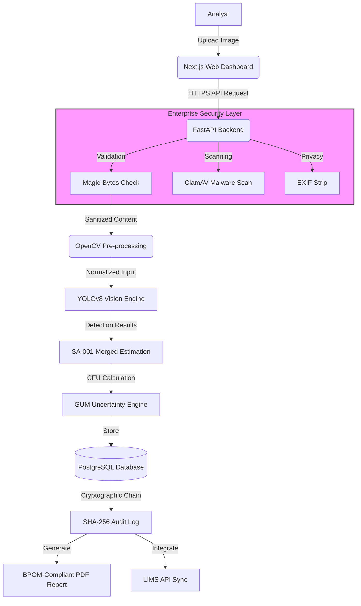

# ColonyAI System Architecture

This diagram illustrates the secure, end-to-end processing pipeline of the ColonyAI platform.

## Data Flow Description
1. **Security-First Ingestion:** Every file undergoes multi-layer validation (MIME check, malware scan, metadata removal) before entering the processing pipeline.
2. **AI Inference:** The YOLOv8 model provides real-time detection across 5 object classes, with merged colony estimation for improved accuracy.
3. **Regulatory Integrity:** Results are calculated with metrological uncertainty (GUM) and finalized with a cryptographically secure audit trail, ensuring full compliance with ISO 17025.
