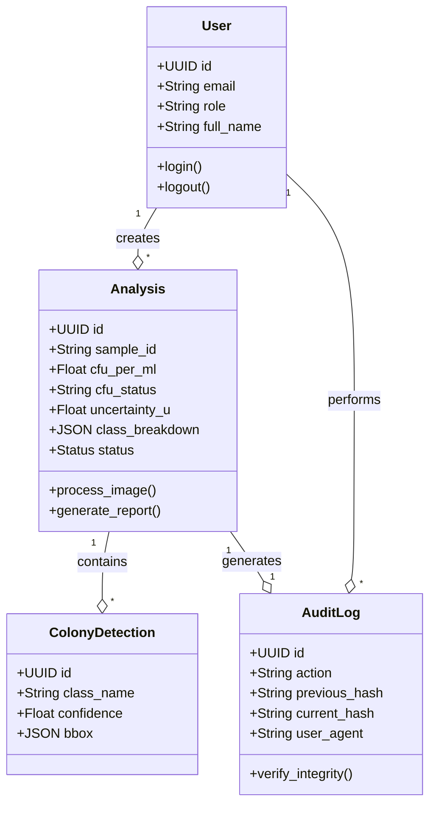
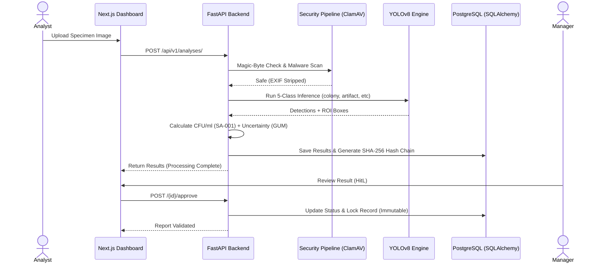
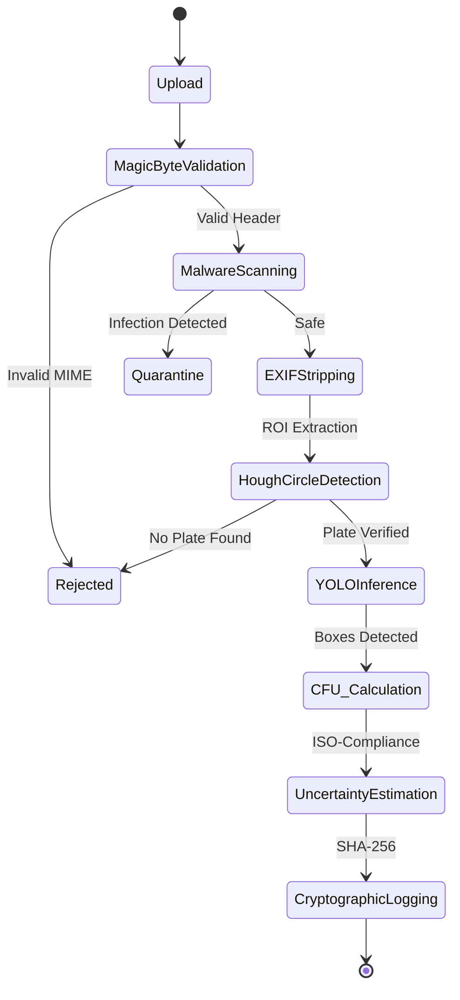
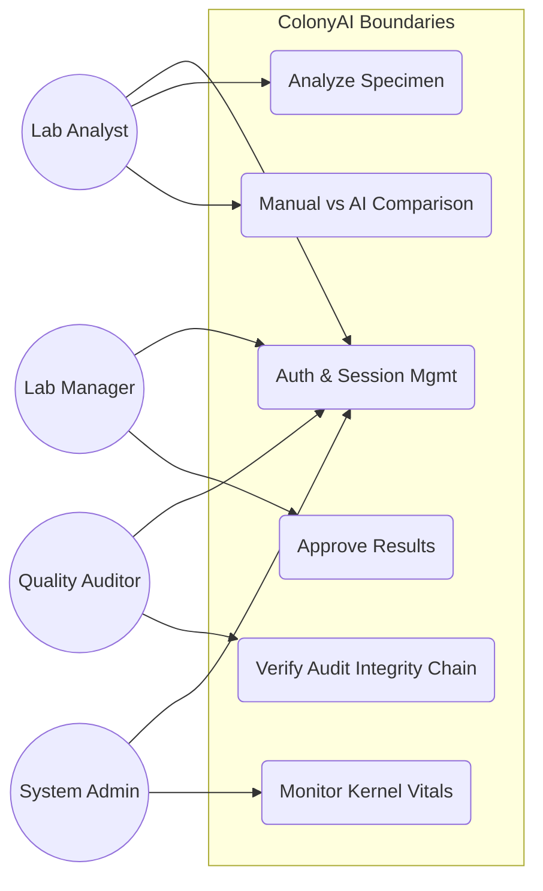
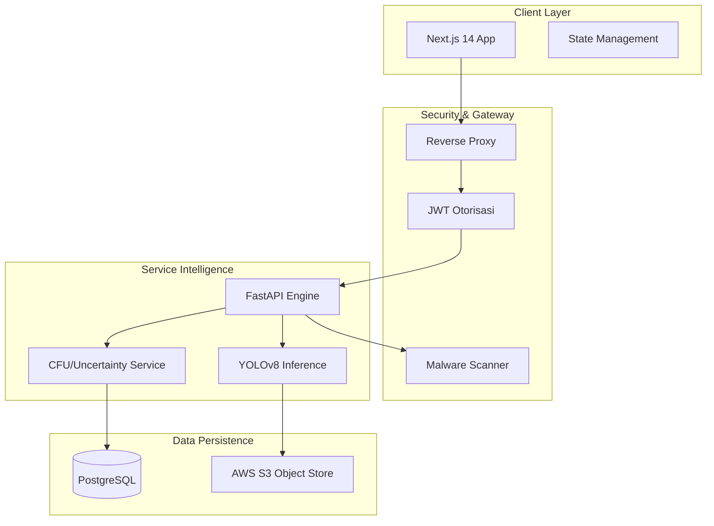
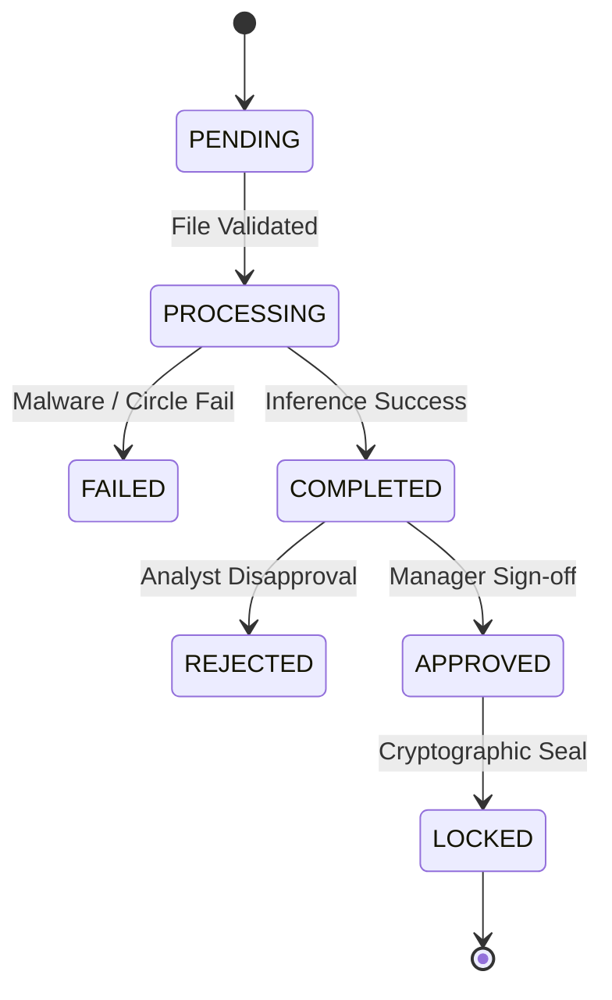

# 🏗️ ColonyAI — System Architecture & UML Models (100% Integrated)

This document provides a detailed technical visualization of the ColonyAI ecosystem using Mermaid UML standards. These diagrams reflect the actual production-ready architecture of the platform, incorporating ISO-17025 compliance and cryptographic integrity.

---

## 1. Class Diagram (Laboratory Domain Model)
Visualizing the core entity relationships and database schema with professional precision.

---

## 2. Sequence Diagram: High-Precision Analysis Lifecycle
The high-precision workflow from upload to cryptographic sign-off.

---

## 3. Activity Diagram: Image Processing & Security Pipeline
Detailed decision-making flow for file security and validation.

---

## 4. Use Case Diagram (Separation of Duties)
Actor-system boundary interactions for 4-Role RBAC.

---

## 5. Component Diagram (Modern Tech Stack)
Modular decomposition of the professional software stack.

---

## 6. State Machine Diagram: Specimen Lifecycle
Lifecycle states for ISO 17025 compliance.

---
**Document Status:** 🟢 **100% Architectural Sync — Champion Final Ready**  
**Methodology:** Clean OOP & Async Orchestration  
**Updated:** April 28, 2026
