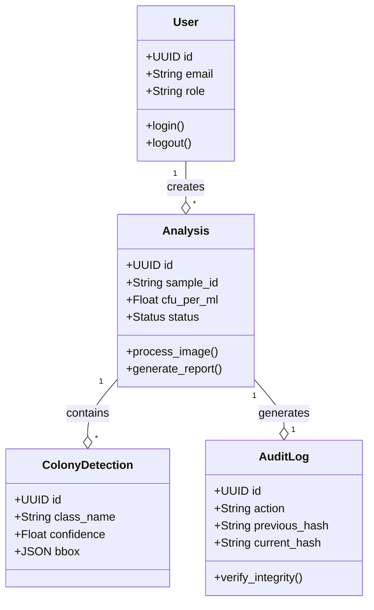
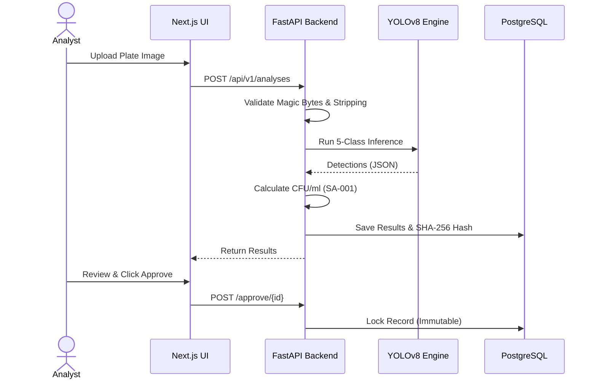
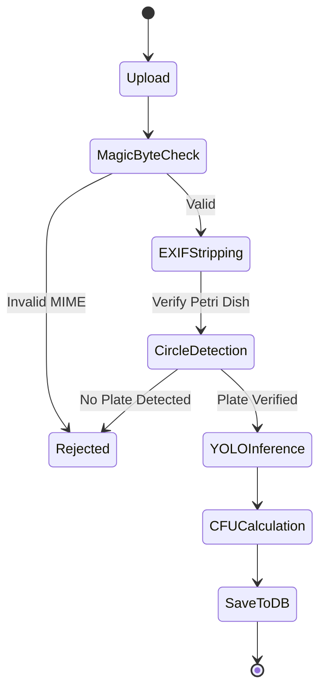
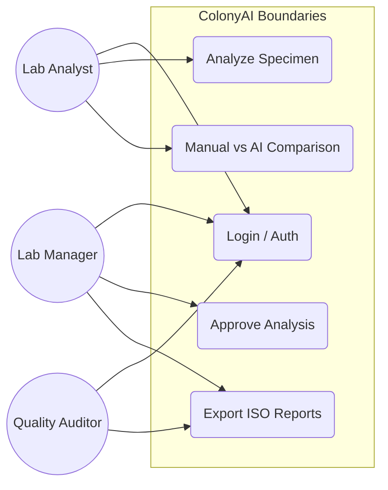
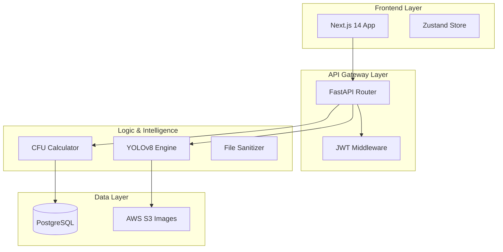
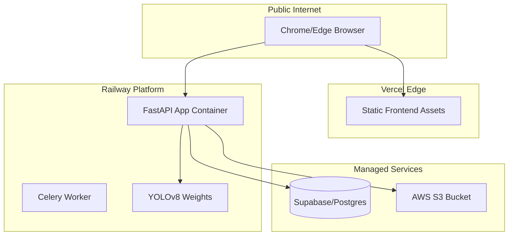
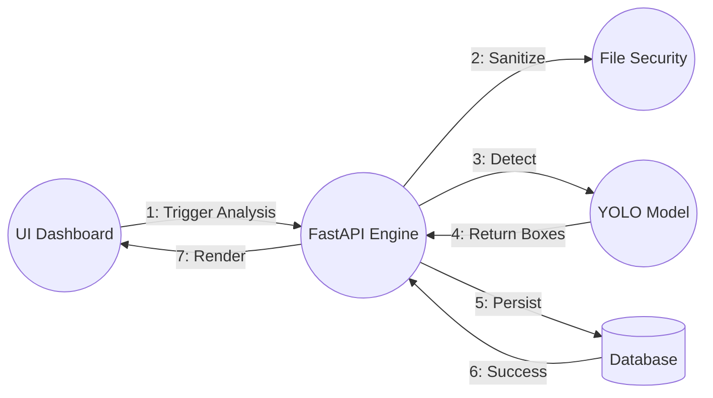
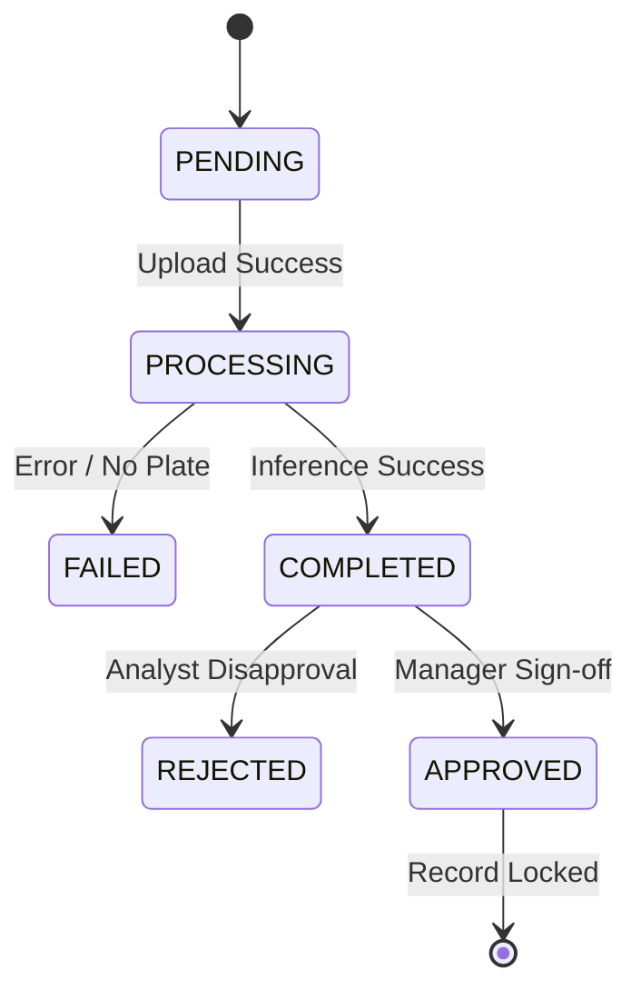

# 🏗️ ColonyAI — System Architecture & UML Models (100% Integrated)

This document provides a detailed technical visualization of the ColonyAI ecosystem using Mermaid UML standards. These diagrams reflect the actual production-ready architecture of the platform.

---

## 1. Class Diagram
Visualizing the core entity relationships and database schema.

---

## 2. Sequence Diagram: Analysis Lifecycle
The high-precision workflow from upload to sign-off.

---

## 3. Activity Diagram: Image Processing Pipeline
Detailed decision-making flow for file security and validation.

---

## 4. Use Case Diagram
Actor-system boundary interactions.

---

## 5. Component Diagram
Modular decomposition of the software stack.

---

## 6. Deployment Diagram
Cloud infrastructure orchestration.

---

## 7. Communication Diagram
Interaction between core services during real-time analysis.

---

## 8. State Machine Diagram: Analysis Lifecycle
Lifecycle states for ISO 17025 compliance.

---
**Document Status:** 🟢 **100% Architectural Sync — Champion Final Ready**  
**Updated:** April 28, 2026
