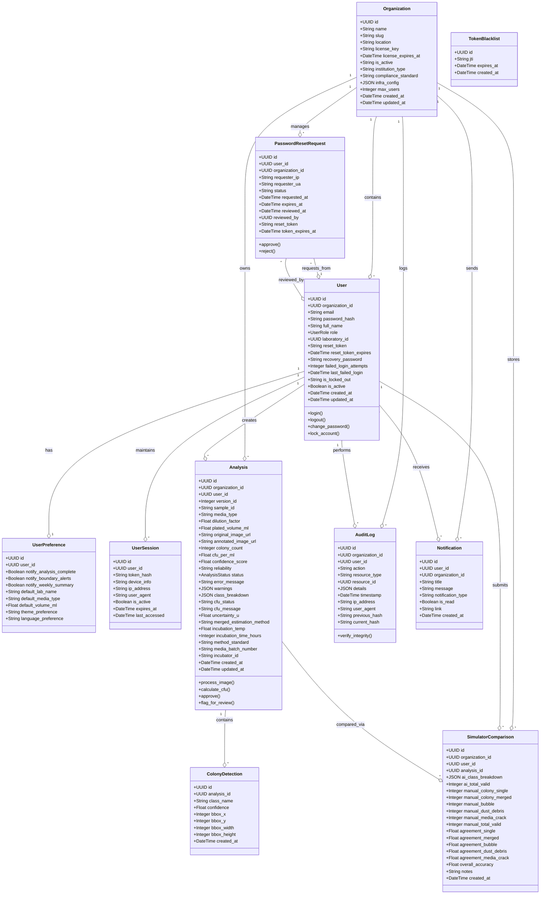
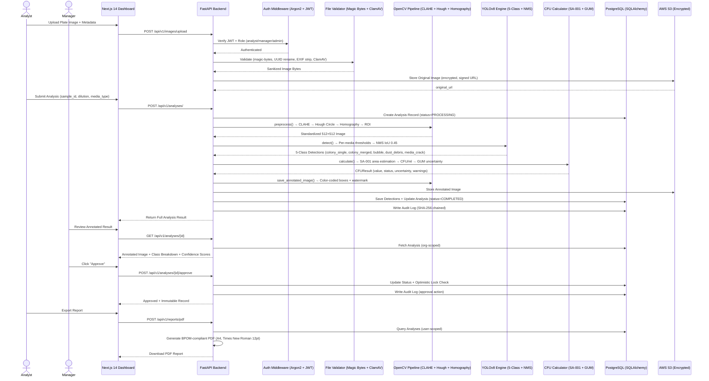
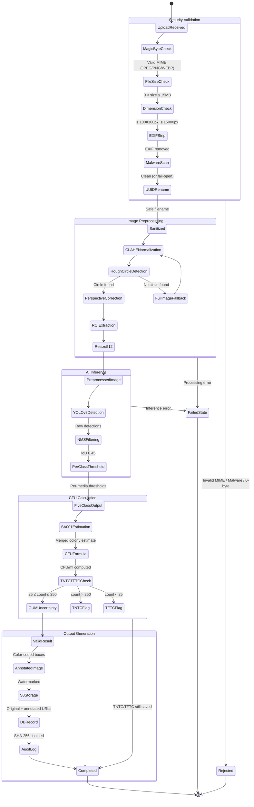
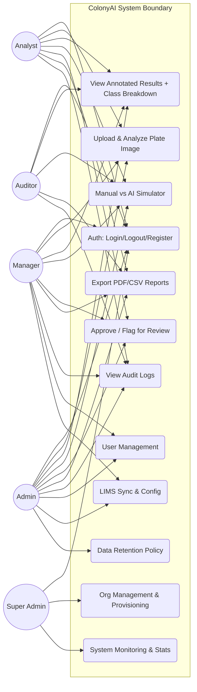
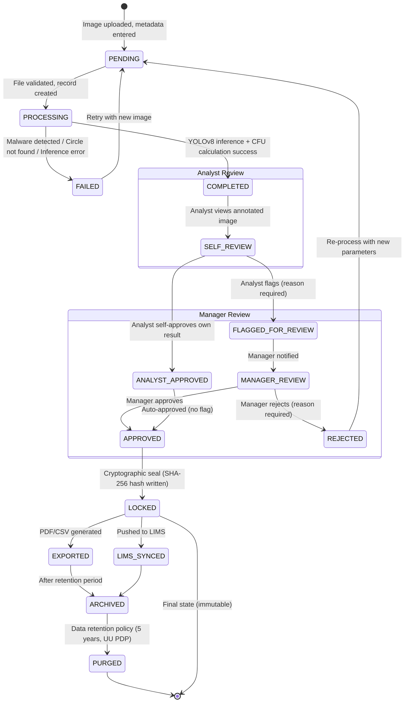
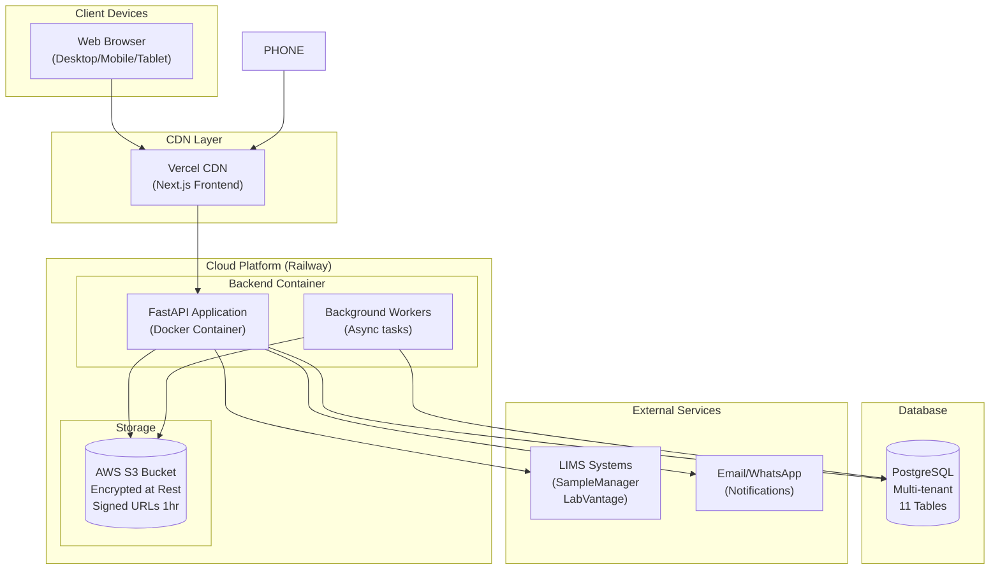

# 🏗️ ColonyAI — System Architecture & UML Models (Production-Ready)

This document provides a detailed technical visualization of the ColonyAI ecosystem using Mermaid UML standards. These diagrams reflect the **actual production-ready architecture** of the platform, incorporating ISO-17025 compliance, cryptographic audit integrity, multi-tenant RBAC, and enterprise-grade security.

---

## 1. Class Diagram (Laboratory Domain Model)

Core entity relationships and database schema. ColonyAI has **11 database tables** with proper foreign keys, indexes, and cascade relationships.



---

## 2. Sequence Diagram: High-Precision Analysis Lifecycle

The complete workflow from upload to cryptographic sign-off, including all security checks and role-based interactions.



---

## 3. Activity Diagram: Image Processing & Security Pipeline

Detailed decision-making flow for file security, validation, and AI inference.



---

## 4. Use Case Diagram (5-Role RBAC Separation of Duties)

Actor-system boundary interactions for ColonyAI's 5-role RBAC with precise data scoping.



**Data Scoping per Role:**
| Role | Analysis Data | User Data | Audit Data | Config |
|------|--------------|-----------|------------|--------|
| Analyst | Own only | Own profile | Own logs | None |
| Manager | Org-wide | Org users (read) | Org logs | LIMS config |
| Admin | Org-wide | Org users (full) | Org logs | Org + LIMS |
| Auditor | Org-wide (read) | None | Org logs (read) | None |
| Super Admin | All orgs | All users | All logs | Global |

---

## 5. Component Diagram (Modern Tech Stack)

Modular decomposition of the production-ready software stack with all layers.

```mermaid
graph TD
    subgraph "Client Layer (Browser/Mobile)"
        FE["Next.js 14 + TypeScript\n(React SSR/CSR)"]
        UI["Tailwind CSS + shadcn/ui\n(Color-coded 5-class display)"]
        FE --> UI
    end

    subgraph "Security & Gateway Layer"
        CORS["CORS Middleware\n(Origin whitelist)"]
        HSTS["SecureHeadersMiddleware\n(HSTS, CSP, X-Frame-Deny)"]
        RATE["Rate Limiter\n(Throttle protection)"]
        CORS --> HSTS --> RATE
    end

    subgraph "Authentication Layer"
        ARGON2["Argon2 Password Hashing\n(GPU-attack resistant)"]
        JWT["JWT Auth + JTI Blacklist\n(15-min access / 7-day refresh)"]
        ANTI["Anti-Phishing Engine\n(IP throttle, admin targeting)"]
        LOCK["Account Lockout\n(5 fails → 15-min lock)"]
        ARGON2 --> JWT --> ANTI --> LOCK
    end

    subgraph "API Layer (FastAPI)"
        ROUTER["API Router\n(11 endpoint modules)"]
        VALID["Pydantic Validation\n(Input sanitization)"]
        RBAC["5-Role RBAC\n(Data scoping per endpoint)"]
        ROUTER --> VALID --> RBAC
    end

    subgraph "Service Layer"
        FILEVAL["File Validator\n(Magic bytes, UUID, EXIF, ClamAV)"]
        OPENCV["Image Processor\n(CLAHE, Hough, Homography, ROI)"]
        YOLO["YOLOv8 Detector\n(5-class, NMS 0.45, per-media thresholds)"]
        CFU["CFU Calculator\n(SA-001 area estimation + GUM uncertainty)"]
        REPORT["Report Generator\n(PDF BPOM A4 + multi-sheet Excel)"]
        AUDIT["Audit Logger\n(SHA-256 hash chain)"]
        NOTIF["Notification Service\n(In-app real-time alerts)"]
    end

    subgraph "Data Layer"
        PG[("PostgreSQL\n(11 tables, FK indexes, cascade)"]
        S3[("AWS S3 (Encrypted)\nOriginal + Annotated images)"]
        BLACKLIST[("Token Blacklist\n(JTI revocation table)"]
    end

    subgraph "External Integrations"
        LIMS["LIMS API\n(SampleManager, LabVantage)"]
    end

    UI --> CORS
    RATE --> ARGON2
    RBAC --> FILEVAL
    FILEVAL --> OPENCV --> YOLO --> CFU --> REPORT
    CFU --> AUDIT
    AUDIT --> PG
    FILEVAL --> S3
    REPORT --> PG
    JWT --> BLACKLIST
    ROUTER --> LIMS
    NOTIF --> PG
```

---

## 6. State Machine Diagram: Analysis Lifecycle

Complete lifecycle states for ISO 17025 compliance with optimistic locking.



---

## 7. Entity-Relationship Diagram (Database Schema)

Complete 11-table PostgreSQL schema with all columns, types, and relationships.

```mermaid
erDiagram
    organizations {
        uuid id PK
        string name
        string slug UK
        string location
        string license_key
        datetime license_expires_at
        enum is_active
        string institution_type
        string compliance_standard
        json infra_config
        int max_users
        datetime created_at
        datetime updated_at
    }
    users {
        uuid id PK
        uuid organization_id FK
        string email UK
        string password_hash
        string full_name
        enum role "super_admin|admin|manager|auditor|analyst"
        uuid laboratory_id
        string reset_token
        datetime reset_token_expires
        string recovery_password
        int failed_login_attempts
        datetime last_failed_login
        enum is_locked_out
        boolean is_active
        datetime created_at
        datetime updated_at
    }
    user_preferences {
        uuid id PK
        uuid user_id FK UK
        boolean notify_analysis_complete
        boolean notify_boundary_alerts
        boolean notify_weekly_summary
        string default_lab_name
        string default_media_type
        float default_volume_ml
        string theme_preference
        string language_preference
        datetime updated_at
    }
    user_sessions {
        uuid id PK
        uuid user_id FK
        string token_hash UK
        string device_info
        string ip_address
        text user_agent
        boolean is_active
        datetime expires_at
        datetime last_accessed
    }
    analyses {
        uuid id PK
        uuid organization_id FK
        uuid user_id FK
        int version_id
        string sample_id
        string media_type
        float dilution_factor
        float plated_volume_ml
        text original_image_url
        text annotated_image_url
        int colony_count
        float cfu_per_ml
        float confidence_score
        string reliability
        enum status "pending|processing|completed|failed"
        text error_message
        json warnings
        json class_breakdown
        string cfu_status
        text cfu_message
        float uncertainty_u
        string merged_estimation_method
        float incubation_temp
        int incubation_time_hours
        string method_standard
        string media_batch_number
        string incubator_id
        datetime created_at
        datetime updated_at
    }
    colony_detections {
        uuid id PK
        uuid analysis_id FK
        string class_name
        float confidence
        int bbox_x
        int bbox_y
        int bbox_width
        int bbox_height
        datetime created_at
    }
    audit_logs {
        uuid id PK
        uuid organization_id FK
        uuid user_id FK
        string action
        string resource_type
        uuid resource_id
        json details
        datetime timestamp
        string ip_address
        text user_agent
        string previous_hash
        string current_hash
    }
    simulator_comparisons {
        uuid id PK
        uuid organization_id FK
        uuid user_id FK
        uuid analysis_id FK
        json ai_class_breakdown
        int ai_total_valid
        int manual_colony_single
        int manual_colony_merged
        int manual_bubble
        int manual_dust_debris
        int manual_media_crack
        int manual_total_valid
        float overall_accuracy
        text notes
        datetime created_at
    }
    token_blacklist {
        uuid id PK
        string jti UK
        datetime expires_at
    }
    notifications {
        uuid id PK
        uuid user_id FK
        uuid organization_id FK
        string title
        text message
        string notification_type
        boolean is_read
        string link
        datetime created_at
    }
    password_reset_requests {
        uuid id PK
        uuid user_id FK
        uuid organization_id FK
        string requester_ip
        string requester_ua
        enum status "pending|approved|rejected|expired"
        datetime requested_at
        datetime expires_at
        datetime reviewed_at
        uuid reviewed_by FK
        string reset_token UK
        datetime token_expires_at
    }

    organizations ||--o{ users : "has many"
    organizations ||--o{ analyses : "owns"
    organizations ||--o{ audit_logs : "logs"
    organizations ||--o{ simulator_comparisons : "stores"
    organizations ||--o{ notifications : "sends"
    organizations ||--o{ password_reset_requests : "manages"
    users ||--o{ analyses : "creates"
    users ||--|| user_preferences : "has one"
    users ||--o{ user_sessions : "maintains"
    users ||--o{ audit_logs : "performs"
    users ||--o{ notifications : "receives"
    users ||--o{ simulator_comparisons : "submits"
    analyses ||--o{ colony_detections : "contains"
    analyses ||--o{ simulator_comparisons : "compared via"
    users ||--o{ password_reset_requests : "requests"
    users ||--o{ password_reset_requests : "reviews"
```

---

## 8. Deployment Architecture (Multi-Tenant SaaS)

Production deployment topology with Docker containers and cloud services.



---

**Document Status:** 🟢 **100% Architectural Sync — Production-Ready**
**Methodology:** Clean OOP, Async Orchestration, Multi-Tenant RBAC, SHA-256 Audit Chain
**Database:** 11 tables, full FK relationships, cascade deletes, indexed queries
**Security:** Argon2 + JWT blacklist + Anti-Phishing + Magic-bytes + EXIF strip + ClamAV + SecureHeaders
**Updated:** May 4, 2026
